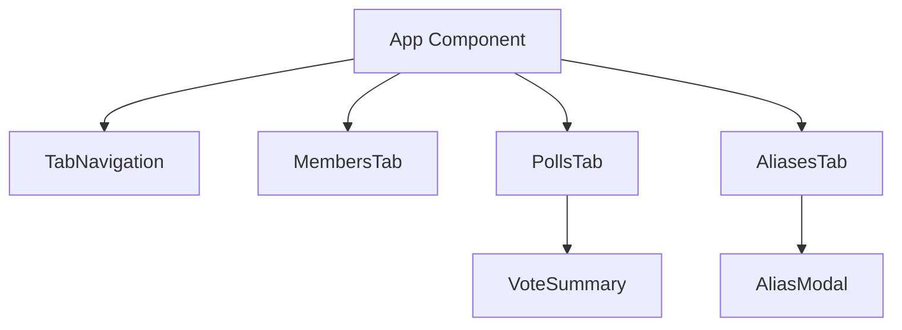
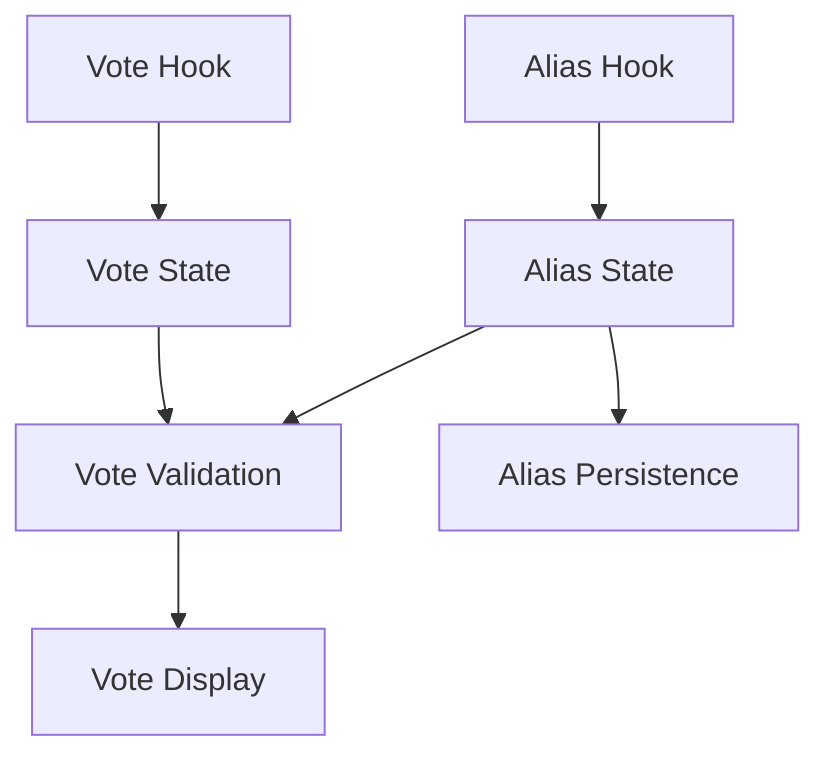
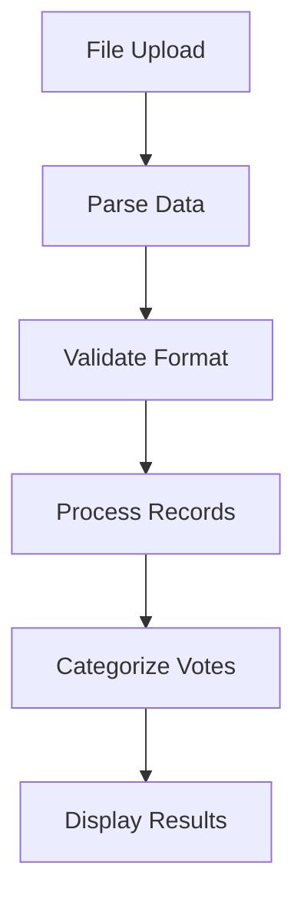
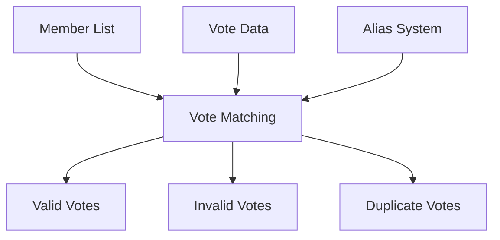

# System Patterns

## Architecture Overview

### Frontend Architecture
- Next.js application with React Server Components
- Component-based architecture with clear separation of concerns
- Custom hooks for state management
- CSS modules for styling
- Material React Table for data display
- Persistent storage using cookies for aliases

### Backend Architecture
- AWS Amplify backend
- User authentication via Cognito user pool
- Data storage using AWS AppSync/DynamoDB
- File processing system for CSV/TSV data

## Component Structure

### Core Components


### Component Responsibilities
1. TabNavigation
   - Manages tab switching
   - Displays counts for members/polls/aliases
   - Handles reset functionality

2. MembersTab
   - Member data file upload
   - Member list display
   - Data validation

3. PollsTab
   - Poll data file upload
   - Vote summary display
   - Invalid/duplicate vote management
   - Integration with alias creation

4. AliasesTab
   - Alias management interface
   - Alias creation and listing
   - Reset functionality

5. VoteSummary
   - Vote statistics visualization
   - Chart display
   - Vote count summaries

6. AliasModal
   - Alias creation interface
   - Member search and selection
   - Form validation

## State Management

### Custom Hooks
1. useVoteProcessing
   - Member data state
   - Poll results state
   - Vote processing logic
   - File upload handling

2. useAliases
   - Alias state management
   - Cookie persistence
   - Modal state
   - Alias creation logic

### State Flow


## Styling Architecture

### CSS Module Structure
- Component-specific CSS modules
- Global styles in globals.css
- Consistent naming conventions
- Responsive design patterns

### Style Organization
```
app/
├── styles/
│   ├── page.module.css
│   ├── TabNavigation.module.css
│   ├── MembersTab.module.css
│   ├── PollsTab.module.css
│   ├── AliasesTab.module.css
│   ├── VoteSummary.module.css
│   └── AliasModal.module.css
└── globals.css
```

## Data Processing Pipeline


## Vote Verification Flow


## Key Implementation Patterns

### Data Validation
- TSV parsing for member lists
- CSV parsing for poll data
- Robust error handling and reporting
- Data cleaning and standardization

### Vote Matching Algorithm
1. Normalize input data (lowercase, trim)
2. Match through multiple methods:
   - Direct alias matches
   - Email matches
   - Name matches (first + last)
3. Categorize results:
   - Valid votes
   - Invalid votes (no match)
   - Duplicate votes (multiple per member)

### UI Patterns
- Tabbed interface for workflow organization
- Search and filter capabilities
- Progressive disclosure of information
- Responsive design elements
- Consistent button styling and interaction patterns

### Error Handling
- Structured error messages
- User-friendly error displays
- Validation at multiple levels:
  - File format validation
  - Data structure validation
  - Business rule validation

## Security Patterns
- AWS Amplify authentication
- Secure file handling
- Data encryption
- Access control
- Cookie-based persistence for non-sensitive data

## Testing Patterns
- Test data files:
  - test-data.csv
  - test-members.txt
- Sample data formats:
  - Attorney General ballots
  - Membership lists
  - Vote verification data

## File Structure
```
/
├── app/
│   ├── components/
│   │   ├── TabNavigation.tsx
│   │   ├── MembersTab.tsx
│   │   ├── PollsTab.tsx
│   │   ├── AliasesTab.tsx
│   │   ├── VoteSummary.tsx
│   │   └── AliasModal.tsx
│   ├── hooks/
│   │   ├── useVoteProcessing.ts
│   │   └── useAliases.ts
│   ├── styles/
│   │   ├── [Component].module.css
│   │   └── page.module.css
│   ├── page.tsx
│   ├── layout.tsx
│   └── globals.css
├── amplify/
│   ├── backend.ts
│   ├── auth/
│   └── data/
└── public/
