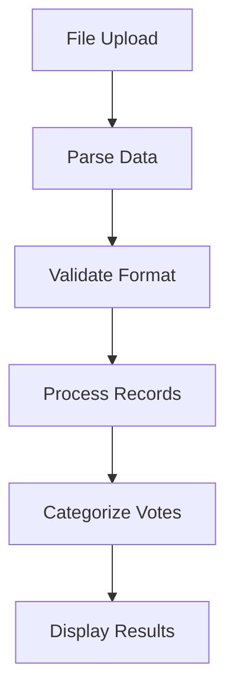
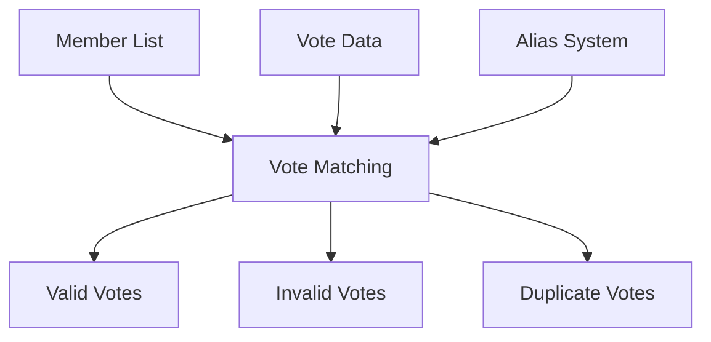
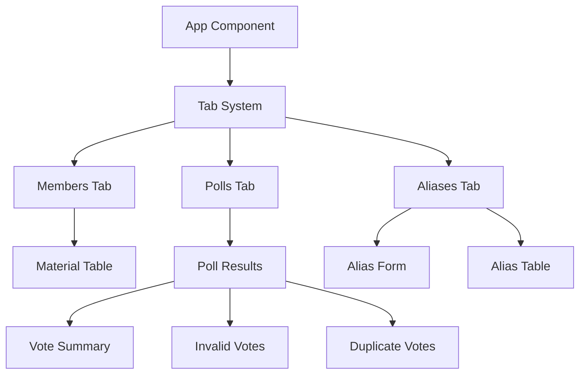

# System Patterns

## Architecture Overview

### Frontend Architecture
- Next.js application with React Server Components
- Client-side state management using React hooks
- Material React Table for data display
- Modal system for user interactions
- Persistent storage using cookies for aliases

### Backend Architecture
- AWS Amplify backend
- User authentication via Cognito user pool
- Data storage using AWS AppSync/DynamoDB
- File processing system for CSV/TSV data

## Core Design Patterns

### Data Processing Pipeline


### Vote Verification Flow


### State Management
- Centralized state for:
  - Member data
  - Poll results
  - Aliases
  - UI state (active tab, modals)
- State updates trigger re-categorization of votes

### Component Organization


## Key Implementation Patterns

### Data Validation
- TSV parsing for member lists
- CSV parsing for poll data
- Robust error handling and reporting
- Data cleaning and standardization

### Vote Matching Algorithm
1. Normalize input data (lowercase, trim)
2. Match through multiple methods:
   - Direct alias matches
   - Email matches
   - Name matches (first + last)
3. Categorize results:
   - Valid votes
   - Invalid votes (no match)
   - Duplicate votes (multiple per member)

### UI Patterns
- Tabbed interface for workflow organization
- Search and filter capabilities
- Progressive disclosure of information
- Responsive design elements
- Consistent button styling and interaction patterns

### Error Handling
- Structured error messages
- User-friendly error displays
- Validation at multiple levels:
  - File format validation
  - Data structure validation
  - Business rule validation

## Security Patterns
- AWS Amplify authentication
- Secure file handling
- Data encryption
- Access control
- Cookie-based persistence for non-sensitive data

## Testing Patterns
- Test data files:
  - test-data.csv
  - test-members.txt
- Sample data formats:
  - Attorney General ballots
  - Membership lists
  - Vote verification data

## File Structure
```
/
├── app/
│   ├── page.tsx (main application)
│   ├── layout.tsx
│   └── globals.css
├── amplify/
│   ├── backend.ts
│   ├── auth/
│   └── data/
└── public/
